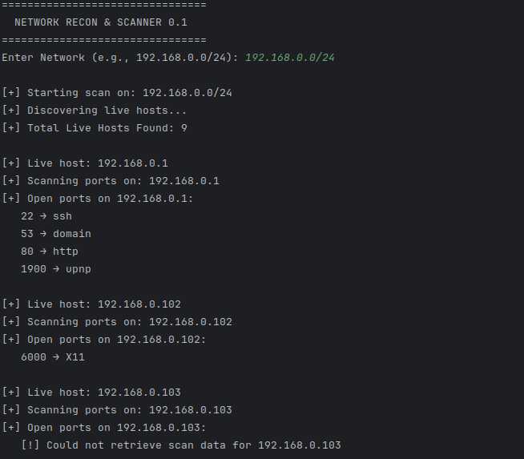
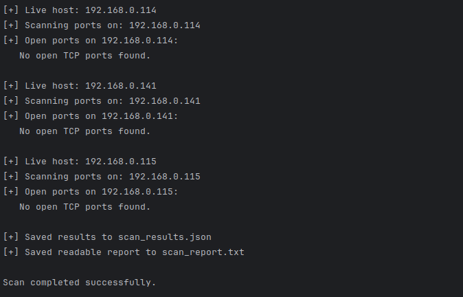

# 🔐 Network Recon & Port Scanner

A **structured, lightweight, and reproducible** Python-based network
reconnaissance tool that:

-   Discovers live hosts on a subnet
-   Performs fast port scanning on each live host
-   Extracts only **open TCP ports**
-   Stores results in **machine-readable JSON**
-   Optionally produces a human-readable text report
-   Validates user input before scanning
-   Handles unreachable or problematic hosts gracefully

Designed for **authorized security learning and lab environments**
------------------------------------------------------------------------

## 🎯 Project Purpose

This project demonstrates practical skills in:

-   Network reconnaissance
-   Port scanning automation
-   Parsing security tool output in Python
-   Input validation and error handling
-   Structured data storage for security workflows

------------------------------------------------------------------------

## 🛠 Tools & Libraries Used

### **System Tools (must be installed)**

  -----------------------------------------------------------------------
  Tool                         Purpose
  ---------------------------- ------------------------------------------
  **nmap**                     Core scanning engine for host discovery
                               and port scanning

  **Kali Linux**               Security testing platform where the tool
                               is executed  (Optional)
  -----------------------------------------------------------------------

Install nmap:

``` bash
sudo apt update
sudo apt install nmap -y
```

### **Python Libraries**

  Library           Purpose
  ----------------- --------------------------------------------------------
  **python-nmap**   Python wrapper around nmap
  **json**          Built-in module to store structured results
  **re**            Built-in module used for validating CIDR network input

Install dependency:

``` bash
pip install python-nmap
```

(Optional but recommended) Use a virtual environment:

``` bash
python3 -m venv venv
source venv/bin/activate
pip install python-nmap
```

------------------------------------------------------------------------

## ⚙️ How the Tool Works (High-Level Flow)

1.  **User provides a network range** (e.g., `192.168.0.0/24`) via
    input
2.  **Input Validation Phase**:
    -   Uses the `re` (regular expressions) module to verify correct
        CIDR format
    -   Checks valid IP ranges (0--255) and CIDR range (/0--/32)
    -   Re-prompts the user if input is invalid
3.  **Discovery Phase**:
    -   Runs `nmap -sn` to find live hosts
4.  **Port Scan Phase**:
    -   Scans each live host using fast flags (`-sS -F --min-rate 500`)
5.  **Result Processing**:
    -   Extracts only **open TCP ports + service names**
6.  **Output Storage**:
    -   Saves structured results to `scan_results.json`
    -   Saves readable summary to `scan_report.txt`

------------------------------------------------------------------------

## ▶️ How to Run

Run from your project directory:

``` bash
python network_scanner.py
```

You will be prompted in the console like:

    Enter Network (e.g., 192.168.0.0/24):

### Example interaction

    Enter Network: 192.168.0.1
    [!] Error: Invalid format. Use something like 192.168.0.0/24

    Enter Network: 300.1.1.0/24
    [!] Error: IP values must be between 0 and 255.

    Enter Network: 192.168.0.0/24
    [+] Starting scan on: 192.168.0.0/24

------------------------------------------------------------------------

## 📁 Output Files

After execution, the tool generates:

    scan_results.json      # Structured, machine-readable output
    scan_report.txt        # Human-readable summary report

### Example `scan_results.json`

``` json
{
    "network": "192.168.0.0/24",
    "scan_time": "2026-02-11 11:30:00",
    "live_hosts": [
        {
            "ip": "192.168.0.1",
            "open_ports": [
                {"port": 22, "service": "ssh"},
                {"port": 80, "service": "http"},
                {"port": 1900, "service": "upnp"}
            ]
        },
        {
            "ip": "192.168.0.104",
            "open_ports": []
        }
    ]
}
```

### Example `scan_report.txt`

    Network: 192.168.0.0/24
    Scan Time: 2026-02-11 11:30:00
    Live Hosts: 2

    Host: 192.168.0.1
      - 22 → ssh
      - 80 → http
      - 1900 → upnp

    Host: 192.168.0.104
      No open TCP ports found

------------------------------------------------------------------------

## 📸 Screenshot

Console screenshot inside a folder named:

    screenshots/


> Screenshot 1

> Screenshot 2


> Console Scan Output.


------------------------------------------------------------------------


## ⚠️ Legal & Ethical Notice

This tool is for **educational and authorized security testing only.**\
Do **not** scan networks you do not own or have explicit permission to
test.\
Unauthorized scanning may be illegal in many jurisdictions.

------------------------------------------------------------------------

## 👤 Author

Kaiser Bhat
